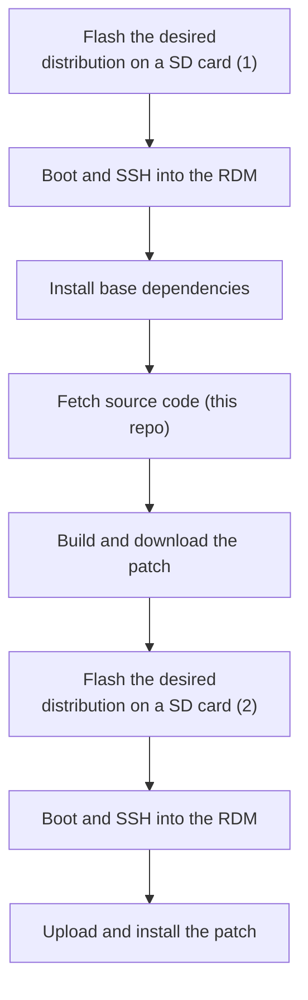

# RaspDac Mini OLED patch compiler

- This branch is still in testing phase. Use with caution.
- This repository will expose methods to build a patch for Volumio and moOde Audio on a Raspdac Mini OLED version. 
- I am trying to make this work on piCoreplayer as well.
- This approach replaces the old preconfigured images way of customizing the RDMOLED.

# In what conditions should you be using this ?
This branch holds the source code used to build a patch for the RaspDacMini OLED Version. 
- You should not use any of this if you have the LCD version instead (color display). [Go to this repo](https://github.com/audiophonics/RaspDacMinilcd) if that is your case.

- If you just want to apply a patch on your own RaspDacMini OLED, you should try to install one of the pre-built patch before attempting to recompile a patch yourself. Here are the available pre-built patches : 
    - [Volumio](https://github.com/audiophonics/RaspDacMini/tree/volumio) >3
    - [moOdeAudio](https://github.com/audiophonics/RaspDacMini/tree/moode) >8
- Rebuilding a patch can be useful you lost the display / remote / SPDIF support after a software update and the pre-built patch does not work anymore on the updated distribution. 
You can also use this branch as a work basis when porting the display to new hardware (RPIO display drivers should run on Beaglebone for instance).

# Usage
Here is the full procedure of that you should be doing : 

(1)(2) You may notice we erase and reflash the SD card after a while. This is because building the patch requires a lot of tools that are not needed anymore after the patch has been built (can slow the system afterwards). Nothing horrible will happen if you use a system which still has compilation tools installed as your everyday streamer, but this is not the cleanest way of doing things so this walkthrough assumes that you do fully respect this procedure.

---

## Building a patch for Volumio
### Install base dependencies
```
sudo apt update -y 
sudo apt install -y build-essential
``` 
Volumio has nodejs installed by default.

### Fetch source files
```
git clone https://github.com/audiophonics/RaspDacMini.git --branch v2.1 --single-branch
cd RaspDacMini
```

### Build patch
```
sh build_all.sh volumio
```
This last command will create a directory *release* containing an archive *install_rdm_volumio.tar.gz* this is the file that you want to get and save on your local computer (use a FTP client is the easiest way to save the archive on your computer).

### Install patch 
*Again, it is best to use a freshly reflashed SD card with a pristine Volumio image as a base to install the patch, or do at least a factory reset to remove all the compilation artifacts.* 

- Use a FTP cllient to upload the *install_rdm_volumio.tar.gz* archive on your RaspDacMini OLED
- SSH into the RDM where the archive is stored 

```
tar -xvzf install_rdm_volumio.tar.gz
sudo sh install_rdm_volumio.sh
```
and that should be all for Volumio.

---

## Building a patch for moOde Audio
### Install base dependencies
```
sudo apt update -y 
sudo apt install -y git
``` 
moOde comes with a compilation toolchain but does not have nodejs installed by default, which is required to build and to run the display. However, the compilation script uses ```apt``` to automatically install nodejs when building the patch. The resulting patch also calls ```apt``` to ensure this dependency is met when applying the patch. So all this is taken care of under the hood.


### Fetch source files
```
git clone https://github.com/audiophonics/RaspDacMini.git --branch v2.1 --single-branch
cd RaspDacMini
```

### Build patch
```
sh build_all.sh moode
```
This last command will create a directory *release* containing an archive *install_rdm_moode.tar.gz* this is the file that you want to get and save on your local computer (use a FTP client is the easiest way to save the archive on your computer).

### Install patch 
*Again, it is best to use a freshly reflashed SD card with a pristine moOdeAudio image as a base to install the patch* 

- Use a FTP cllient to upload the *install_rdm_moode.tar.gz* archive on your RaspDacMini OLED
- SSH into the RDM where the archive is stored 

```
tar -xvzf install_rdm_moode.tar.gz
sudo sh install_rdm_moode.sh
```
and that should be all for moOde.


---

## Building a patch for piCorePlayer
This part is a work in progress
